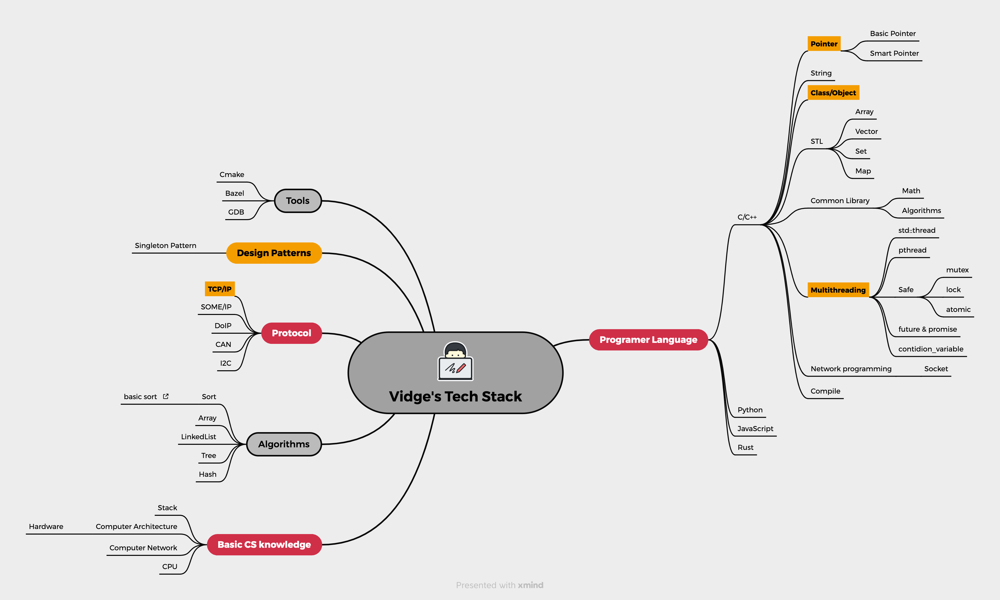

## Hi, I\'m Vidge 👋 

### What do I do?
**Just** an ordinary programmer, trying to leave some traces behind.

### Passions & Character
**INTJ** and here\'s a little bit about me:
- **Big eyes:** I\'m particularly good at finding beauty, whether it\'s an excellent sentence in a book or a distinctive landscape, especially for women, and by that I mean inner beauty.
- **Electronics Enthusiast:** As long as I work hard, I can buy more electronic products that will eat dust!
- **Perfection Pursuer:** I want to pursue perfection in both code and life, but I often anxious about trivial matters. So, fuck perfectionism, completion is more important than perfection. Well, I need to remind myself constantly.
- **Some Hobbies:** I might have a preference for gaming and photography. I also enjoy watching movies, traveling, dining out with friends... it\'s all consumption, maybe I just enjoy consuming. I try to read some books later.

### The Unconventional
- **Evolution Skeptic:** Some say humans evolved, but I\'m not entirely convinced. Maybe we\'re all just cleverly coded biological machines, who knows?🧬

### A little ability
- Familiar with computer systems and familiar with basic data structures and algorithms.
- Can write some **C/C++**, Python, Golang, JavaScript code.
- Familiar with Unix-like systems and real-time operating systems. With long-term embedded development experience.
- Familiar with common modules of **AUTOSAR**, such as *communication*, *diagnostic*, *time synchronization*.
