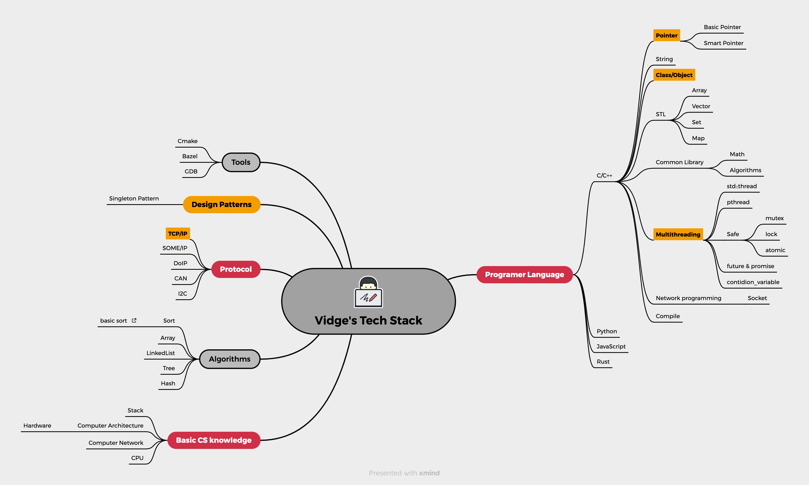

## Hi，我是 Vidge 👋

### 干什么的？
**只是**一名普通的程序员，想留下点痕迹。

### 我是什么样的？
**INTJ**，以下是我的一些特点：
- **大眼睛：** 我特别善于发现美，无论是在书中读到的优美句子，还是独特的风景，尤其是对于女性，当然我指的是内在美。
- **电子产品爱好者：** 只要我努力工作，就能购买更多会积灰的电子产品！
- **完美主义者：** 我希望在代码和生活中追求完美，但常常感到焦虑。所以，去他妈的完美主义，完成比完美更重要。嗯，我需要不断提醒自己。
- **一些爱好：** 我可能偏爱游戏和摄影。我也喜欢看电影、旅行、与朋友外出就餐……好像都是消费，或许我只是享受消费, 不过最近正在看一些书。

### 一点想法
- **进化论怀疑者：** 有人说人类是进化而来的，我怎么就不太信呢？🧬
- **反对儒家, 反对儒学** 

### 一些能力
- 熟悉计算机系统，了解基本的数据结构和算法。
- 能编写一些 **C/C++**、Rust、Python、Golang、JavaScript 代码。
- 熟悉类 Unix 系统和实时操作系统。拥有长期的嵌入式开发经验。
- 熟悉 **AUTOSAR** 的常见模块，如 *通信*、*诊断*、*时间同步*。
