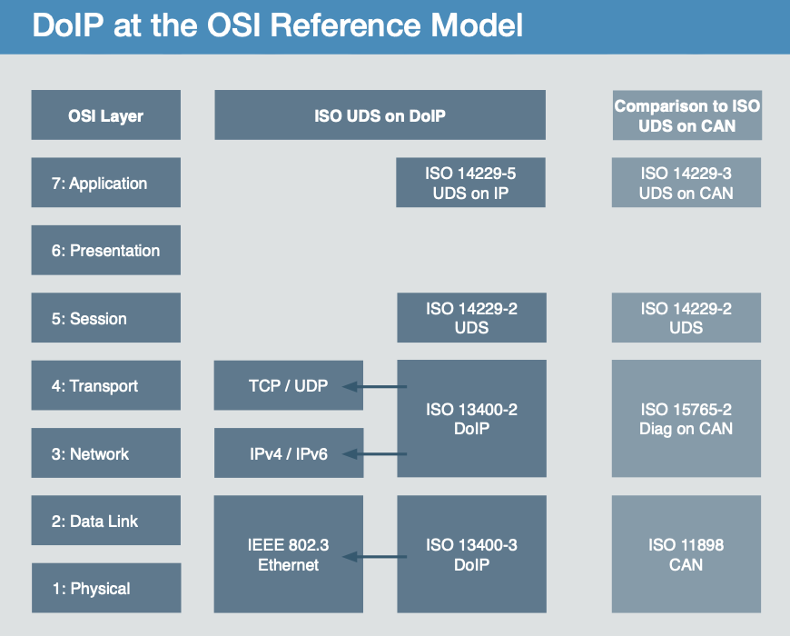
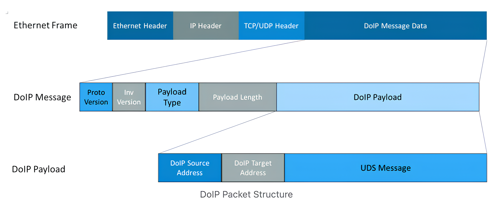
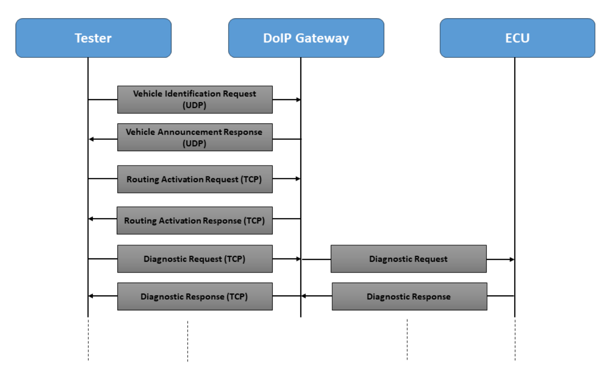

## Overview
- Full name of DoIP: Diagnostic Communication Over Internet Protocol. 
- Short and simple: DoIP is the packaging of Diagnostic messages in Ethernet frames for communiction of a diagnostic tester with a vehcile.

## Position 
- The DoIP is not at the applicatin layer but spans the transport layer and ethernet layer.
- The DoIP protocol specifies the use of TCP/UDP protocols to transmit UDS data. And expands its own protocl at the transport layer, that is, it becomes a DoIP message at the transport layer. In this way, The UDS data will be included in the DoIP message. At this time, it can be narrowly considered that DoIP is at the transport layer.
- DoIP specifies at the data link layer: 1. Physical device requirments; 2. Use of Ethernet protocol for final data transmission between devices.

## Frame structure

## DoIP communication sequence

1. Pyhsical connection between the diagnostic tester and DoIP entity;
2. The activation line will activate the diagnostic functions in the DoIP entity; 
3. The Tester sends vehicle identification request to each 13400 port in the network through UDP boardcast.
4. The DoIP entity replies to tester with a vehicle indentification response which includes the VIN, IP address, etc.
5. The Tester selects DoIP entity (IP address) to activate the TCP connection.
6. The Tester sends a routing activation request to the DoIP entity.
7. The DoIP entity replies with a rouoting activation response.
8. UDS service loop betwwen the tester and DoIP entity.

