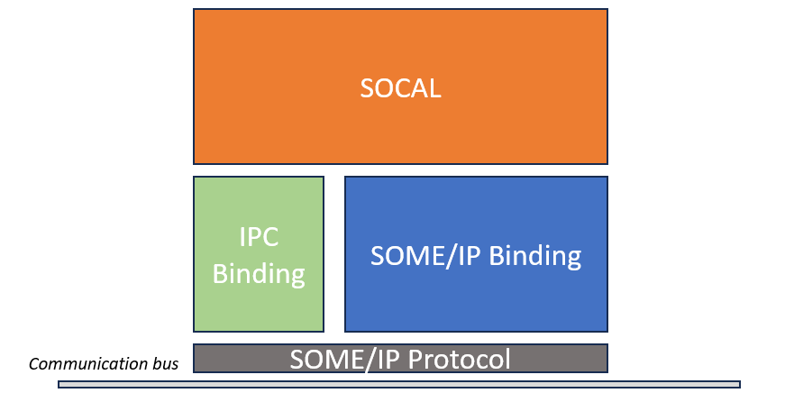

## Acronyms and Abbreviations
- AutoSar: Automotive Open System Architecture  
- SWC: Software Component
- BSW: Basic Software
- SOME/IP(SOMEIP): Scalable service-Oriented MiddlewarE over IP  
- IPC: Inter Process Communication

## Overview

*SOME/IP*: 
- SOMEIP middleware has been proposed to solve the problem of service unification and remote invocation within a network. This middleware is loacated at the application layer. 
- Each SWC can use the SOMEIP interface to interact whit other SWCs through *someipd(SOMEIP-Deamon)*.

*IPC*: 
- IPC refers to communication or information exchange between different processes. The methods include Pipline, FIFO, Semaphore, Socket, Streams and so on.
- In Autosar, IPC uses the protocol of SOME/IP and the CM implements the communication stack in BSW.

*SOCAL*: 
- CM implements SOCAL, and the communication protocol is unified using SOME/IP protocol. So that either SWCs on the same ECU or SWCs on different ECUs can communicate via SOCAL without having to care the underlying communication method.



## SOME/IP protocol
Applications can use SOME/IP to offer or acquire certain types of services. SOME/IP defines several service interface types:

### Method
Methods are used for request/response communication patterns. They can be categorized into:
- **Methods with return values**: Client sends a request and expects a response
  - Synchronous calls: Client waits for response
  - Asynchronous calls: Client continues execution and handles response later
- **Methods without return values (Fire & Forget)**: Client sends request without expecting response

### Event
Events implement the publish/subscribe pattern:
- A consumer can subscribe to event messages from a provider
- The provider sends messages either:
  - Periodically at configured intervals
  - When event data changes
- Events are unidirectional (provider to subscriber)
- Multiple subscribers can receive the same event

### Fields
Fields represent data elements that can be accessed remotely. They combine getter/setter methods with notifications:

1. **Getter**: Read access to field value
   - Client requests current value
   - Server responds with value

2. **Setter**: Write access to field value
   - Client sends new value
   - Server updates field
   - Optional response confirms update

3. **Notification**: Change notification for field value
   - Similar to events
   - Subscribers receive updates when field value changes
   - Can be configured for periodic updates

### Message Structure
SOME/IP messages consist of:

```
+---------------+----------------+----------------+----------------+
| Message Header| Request ID    | Protocol Ver   | Interface Ver  |
+---------------+----------------+----------------+----------------+
| Message Type  | Return Code   | Payload Length | Payload        |
+---------------+----------------+----------------+----------------+
```

- Message Header: Contains routing information
- Request ID: Identifies service and method
- Protocol Version: SOME/IP protocol version
- Interface Version: Service interface version
- Message Type: Request/Response/Notification/Error
- Return Code: Success/Error indication
- Payload: Actual data being transmitted

### Service Discovery
SOME/IP includes a Service Discovery (SD) protocol that:
- Announces available services
- Handles service instance finding
- Manages subscribe/unsubscribe for events
- Supports service availability monitoring

### Communication Patterns
SOME/IP supports multiple communication patterns:
1. Client/Server (Request/Response)
2. Publish/Subscribe (Events)
3. Fire & Forget (One-way messages)

These patterns can be used over various transport protocols:
- TCP for reliable communication
- UDP for efficient broadcast/multicast
- IPC for local communication